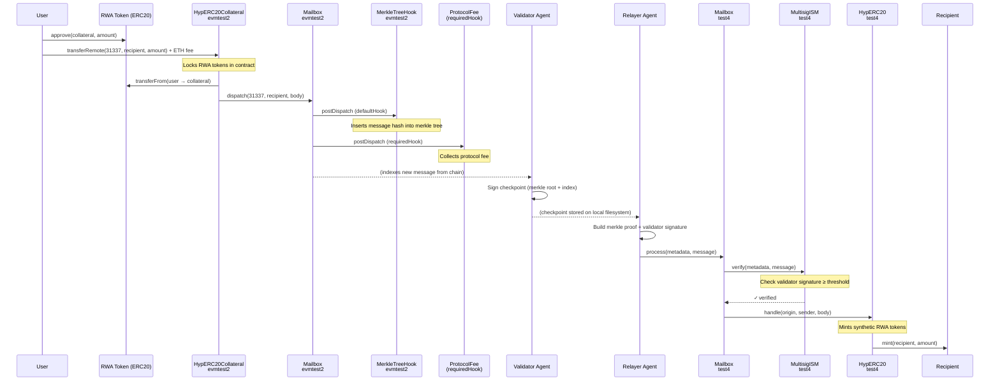
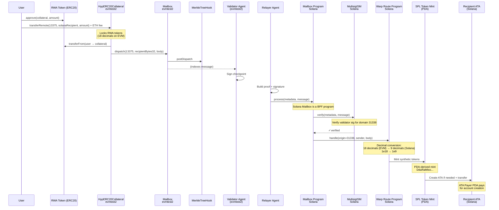
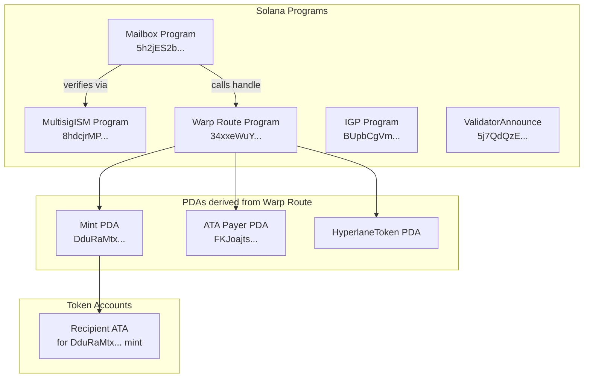
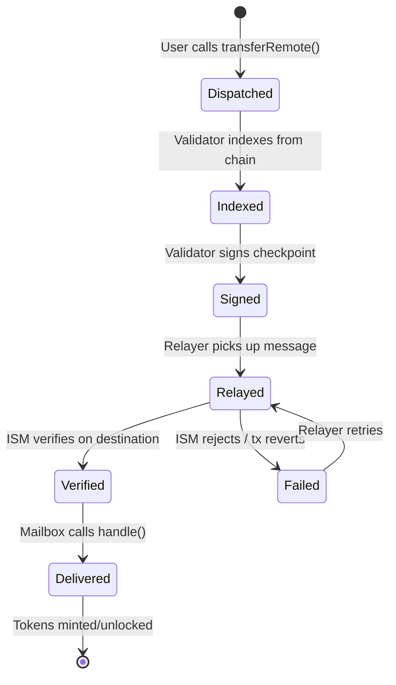

# Hyperlane Bridge — Token Transfer Flow

## High-Level Overview

```mermaid
flowchart LR
    subgraph Source Chain
        User([User]) -->|1. transferRemote| WarpSrc[Warp Route\nCollateral/Synthetic]
        WarpSrc -->|2. lock/burn tokens| WarpSrc
        WarpSrc -->|3. dispatch message| MailboxSrc[Mailbox]
        MailboxSrc -->|4. record in tree| MerkleHook[MerkleTreeHook]
    end

    subgraph Off-Chain Agents
        MerkleHook -.->|5. index & sign checkpoint| Validator[Validator]
        Validator -.->|6. store signature| CheckpointStorage[(Checkpoint\nStorage)]
        CheckpointStorage -.->|7. fetch proof + sig| Relayer[Relayer]
    end

    subgraph Destination Chain
        Relayer -->|8. process message| MailboxDst[Mailbox]
        MailboxDst -->|9. verify via ISM| ISM[MultisigISM]
        ISM -->|10. approved| MailboxDst
        MailboxDst -->|11. handle| WarpDst[Warp Route\nSynthetic/Collateral]
        WarpDst -->|12. mint/unlock tokens| Recipient([Recipient])
    end
```

---

## EVM → EVM Transfer (evmtest2 → test4)

Token: **RWA Token** — Collateral on evmtest2, Synthetic on test4.

### Reverse: test4 → evmtest2

When sending **back** from test4 to evmtest2, the synthetic tokens are **burned** on test4 and the original collateral tokens are **unlocked** on evmtest2.

---

## EVM → Solana Transfer (evmtest2 → sealeveltest1)

Token: **RWA Token** — Collateral on evmtest2, Synthetic on Solana.

### Key Differences: EVM vs Solana Destination

| Aspect           | EVM Destination                         | Solana Destination                               |
| ---------------- | --------------------------------------- | ------------------------------------------------ |
| Token standard   | ERC20                                   | SPL Token (Token-2022)                           |
| Decimals         | 18 (same as source)                     | 9 (converted from 18)                            |
| Recipient format | 20-byte address, left-padded to bytes32 | 32-byte ed25519 pubkey                           |
| Account creation | Not needed                              | ATA created automatically, paid by ATA Payer PDA |
| Delivery         | Single EVM transaction                  | Solana transaction with multiple accounts        |
| ISM verification | On-chain Solidity contract              | On-chain BPF program                             |

---

## Account & PDA Relationships (Solana)

---

## Message Lifecycle States

---

## Address Quick Reference (Local Setup)

### EVM (Deterministic on fresh Anvil)

| Contract              | Address                                      |
| --------------------- | -------------------------------------------- |
| Mailbox (both chains) | `0x8A791620dd6260079BF849Dc5567aDC3F2FdC318` |
| MerkleTreeHook        | `0xB7f8BC63BbcaD18155201308C8f3540b07f84F5e` |
| ValidatorAnnounce     | `0x0B306BF915C4d645ff596e518fAf3F9669b97016` |
| ProtocolFee (IGP)     | `0xA51c1fc2f0D1a1b8494Ed1FE312d7C3a78Ed91C0` |

### Solana (Deterministic with reused keypairs)

| Program                          | Address                                        |
| -------------------------------- | ---------------------------------------------- |
| Mailbox                          | `5h2jES2bYcffrQSqUhJ4w6FXcdrZXkHaZXmKHV51Y77e` |
| MultisigISM                      | `8hdcjrMPhexzNuxeWKJnNVCTUoY1MMjvABY7biQuP5gy` |
| ValidatorAnnounce                | `5j7QdQzEdNiERdh3h6e18KeCv2J38tR5PtS5NzVFWg4x` |
| IGP                              | `BUpbCgVm5KVovNtsekPcEGQ3Shhq9DtTgBdTdLP1odCp` |
| Warp Route (changes each deploy) | check `program-ids.json`                       |
